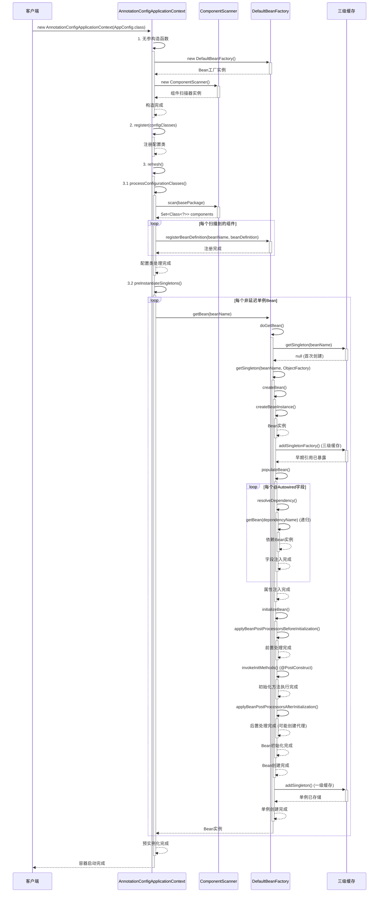

# Mini Spring IOC 代码链路详解

## 🎯 概述

本文档详细分析 Mini Spring IOC 容器的完整代码执行链路，从容器启动到 Bean 实例化的全过程。IOC 容器是 Spring 框架的核心，负责管理对象的创建、配置、组装和生命周期。

## 📋 核心组件架构

```
AnnotationConfigApplicationContext (应用上下文)
    ├── DefaultBeanFactory (Bean工厂)
    │   ├── 三级缓存 (循环依赖解决)
    │   ├── BeanDefinition注册表 (Bean元数据)
    │   └── BeanPostProcessor链 (后置处理器)
    ├── ComponentScanner (组件扫描器)
    └── Properties (配置属性)
```

## 🚀 完整启动链路

### 1. 容器初始化阶段

#### 1.1 构造函数调用
```java
// 用户代码
AnnotationConfigApplicationContext context = new AnnotationConfigApplicationContext(AppConfig.class);

// 内部执行链路
public AnnotationConfigApplicationContext(Class<?>... configClasses) {
    this(); // 调用无参构造函数
    register(configClasses); // 注册配置类
    refresh(); // 刷新容器
}
```

#### 1.2 无参构造函数执行
```java
public AnnotationConfigApplicationContext() {
    this.beanFactory = new DefaultBeanFactory();           // ✅ 创建Bean工厂
    this.componentScanner = new ComponentScanner();        // ✅ 创建组件扫描器
    this.properties = new Properties();                    // ✅ 创建属性容器
    this.configurationClasses = new HashSet<>();          // ✅ 配置类集合
    this.disposableBeans = new ArrayList<>();             // ✅ 可销毁Bean列表
    
    registerDefaultBeanPostProcessors();                   // ✅ 注册默认后置处理器
    loadProperties();                                      // ✅ 加载配置文件
}
```

#### 1.3 DefaultBeanFactory 初始化
```java
public class DefaultBeanFactory implements BeanFactory {
    // 三级缓存 - Spring循环依赖解决方案
    private final Map<String, Object> singletonObjects = new ConcurrentHashMap<>();         // 一级缓存：完成的单例
    private final Map<String, Object> earlySingletonObjects = new ConcurrentHashMap<>();    // 二级缓存：早期单例
    private final Map<String, ObjectFactory<?>> singletonFactories = new ConcurrentHashMap<>(); // 三级缓存：单例工厂
    
    // Bean定义注册表
    private final Map<String, BeanDefinition> beanDefinitionMap = new ConcurrentHashMap<>();
    private final List<String> beanDefinitionNames = new ArrayList<>();
    
    // Bean后置处理器
    private final List<BeanPostProcessor> beanPostProcessors = new ArrayList<>();
    
    // 正在创建的Bean集合（用于检测循环依赖）
    private final Set<String> singletonsCurrentlyInCreation = Collections.synchronizedSet(new HashSet<>());
}
```

### 2. 配置类注册阶段

```java
// 注册配置类
public void register(Class<?>... configClasses) {
    for (Class<?> configClass : configClasses) {
        this.configurationClasses.add(configClass);  // ✅ 添加到配置类集合
    }
}
```

### 3. 容器刷新阶段 (refresh)

```java
@Override
public void refresh() {
    try {
        // 1️⃣ 处理配置类
        processConfigurationClasses();
        
        // 2️⃣ 实例化所有非延迟加载的单例Bean
        preInstantiateSingletons();
        
        // 3️⃣ 标记容器为活跃状态
        this.active = true;
        
        System.out.println("Spring容器启动完成，共注册了 " + beanFactory.getBeanDefinitionNames().length + " 个Bean");
        
    } catch (Exception e) {
        throw new RuntimeException("容器刷新失败", e);
    }
}
```

## 🔍 配置类处理链路

### 3.1 processConfigurationClasses()
```java
private void processConfigurationClasses() {
    for (Class<?> configClass : configurationClasses) {
        processConfigurationClass(configClass);  // ✅ 处理每个配置类
    }
}
```

### 3.2 processConfigurationClass()
```java
private void processConfigurationClass(Class<?> configClass) {
    // 1️⃣ 注册配置类本身
    registerBean(configClass);
    
    // 2️⃣ 处理@ComponentScan注解
    if (configClass.isAnnotationPresent(ComponentScan.class)) {
        ComponentScan componentScan = configClass.getAnnotation(ComponentScan.class);
        String[] basePackages = getBasePackages(componentScan, configClass);
        
        // 扫描每个包
        for (String basePackage : basePackages) {
            Set<Class<?>> scannedClasses = componentScanner.scan(basePackage);  // ✅ 包扫描
            for (Class<?> clazz : scannedClasses) {
                registerBean(clazz);  // ✅ 注册扫描到的Bean
            }
        }
    }
}
```

## 📦 组件扫描链路

### 4.1 ComponentScanner.scan()
```java
public Set<Class<?>> scan(String basePackage) {
    Set<Class<?>> components = new HashSet<>();
    
    try {
        // 使用Reflections库进行包扫描
        Reflections reflections = new Reflections(basePackage);
        
        // 扫描所有带@Component注解的类
        Set<Class<?>> componentClasses = reflections.getTypesAnnotatedWith(Component.class);
        components.addAll(componentClasses);
        
        System.out.println("扫描包 '" + basePackage + "' 发现 " + components.size() + " 个组件");
        
    } catch (Exception e) {
        System.err.println("扫描包失败: " + basePackage + ", 错误: " + e.getMessage());
    }
    
    return components;
}
```

### 4.2 registerBean() - Bean注册
```java
private void registerBean(Class<?> beanClass) {
    String beanName = determineBeanName(beanClass);  // ✅ 确定Bean名称
    
    if (beanFactory.containsBean(beanName)) {
        return; // 已注册，跳过
    }
    
    BeanDefinition beanDefinition = new BeanDefinition(beanClass);  // ✅ 创建Bean定义
    
    // 处理作用域等元数据
    if (beanClass.isAnnotationPresent(Component.class)) {
        Component component = beanClass.getAnnotation(Component.class);
        // 扩展：处理Scope注解等
    }
    
    beanFactory.registerBeanDefinition(beanName, beanDefinition);  // ✅ 注册到工厂
    System.out.println("注册Bean: " + beanName + " -> " + beanClass.getSimpleName());
}
```

## 🏭 Bean实例化链路

### 5.1 preInstantiateSingletons() - 预实例化
```java
private void preInstantiateSingletons() {
    String[] beanNames = beanFactory.getBeanDefinitionNames();
    
    for (String beanName : beanNames) {
        BeanDefinition bd = beanFactory.getBeanDefinition(beanName);
        if (bd != null && bd.isSingleton() && !bd.isLazyInit()) {
            try {
                Object bean = beanFactory.getBean(beanName);  // ✅ 触发Bean创建
                
                // 收集DisposableBean
                if (bean instanceof DisposableBean) {
                    disposableBeans.add((DisposableBean) bean);
                }
                
            } catch (Exception e) {
                System.err.println("预实例化Bean失败: " + beanName + ", 错误: " + e.getMessage());
            }
        }
    }
}
```

### 5.2 getBean() - 获取Bean入口
```java
@Override
public Object getBean(String name) throws BeansException {
    return doGetBean(name, null);  // ✅ 调用核心获取方法
}
```

### 5.3 doGetBean() - 核心获取逻辑
```java
protected Object doGetBean(String name, Class<?> requiredType) throws BeansException {
    // 1️⃣ 尝试从三级缓存获取
    Object singleton = getSingleton(name);
    if (singleton != null) {
        return singleton;  // ✅ 缓存命中，直接返回
    }
    
    // 2️⃣ 获取Bean定义
    BeanDefinition beanDefinition = getBeanDefinition(name);
    if (beanDefinition == null) {
        throw new BeansException("No bean named '" + name + "' is defined");
    }
    
    // 3️⃣ 创建Bean实例
    if (beanDefinition.isSingleton()) {
        singleton = getSingleton(name, () -> createBean(name, beanDefinition));  // ✅ 单例创建
        return singleton;
    } else {
        return createBean(name, beanDefinition);  // ✅ 原型创建
    }
}
```

## 🔄 三级缓存循环依赖解决

### 6.1 三级缓存查找
```java
protected Object getSingleton(String beanName) {
    // 1️⃣ 一级缓存：完成的单例对象
    Object singletonObject = singletonObjects.get(beanName);
    
    if (singletonObject == null && isSingletonCurrentlyInCreation(beanName)) {
        // 2️⃣ 二级缓存：早期单例对象
        singletonObject = earlySingletonObjects.get(beanName);
        
        if (singletonObject == null) {
            // 3️⃣ 三级缓存：单例工厂
            ObjectFactory<?> singletonFactory = singletonFactories.get(beanName);
            if (singletonFactory != null) {
                singletonObject = singletonFactory.getObject();  // ✅ 工厂创建
                earlySingletonObjects.put(beanName, singletonObject);  // ✅ 升级到二级缓存
                singletonFactories.remove(beanName);  // ✅ 移除三级缓存
            }
        }
    }
    
    return singletonObject;
}
```

### 6.2 getSingleton() - 带工厂方法
```java
protected Object getSingleton(String beanName, ObjectFactory<?> singletonFactory) {
    synchronized (singletonObjects) {
        Object singletonObject = singletonObjects.get(beanName);
        if (singletonObject == null) {
            beforeSingletonCreation(beanName);  // ✅ 标记创建中
            try {
                singletonObject = singletonFactory.getObject();  // ✅ 执行工厂方法
                addSingleton(beanName, singletonObject);  // ✅ 添加到一级缓存
            } finally {
                afterSingletonCreation(beanName);  // ✅ 移除创建中标记
            }
        }
        return singletonObject;
    }
}
```

## 🔨 Bean创建详细链路

### 7.1 createBean() - Bean创建入口
```java
protected Object createBean(String beanName, BeanDefinition beanDefinition) throws BeansException {
    try {
        // 1️⃣ 创建Bean实例
        Object bean = createBeanInstance(beanName, beanDefinition);
        
        // 2️⃣ 早期暴露Bean（解决循环依赖）
        if (beanDefinition.isSingleton() && isSingletonCurrentlyInCreation(beanName)) {
            addSingletonFactory(beanName, () -> getEarlyBeanReference(beanName, beanDefinition, bean));
        }
        
        // 3️⃣ 属性注入
        populateBean(beanName, beanDefinition, bean);
        
        // 4️⃣ 初始化Bean
        Object exposedObject = initializeBean(beanName, bean, beanDefinition);
        
        return exposedObject;
    } catch (Exception e) {
        throw new BeanCreationException(beanName, "Bean creation failed", e);
    }
}
```

### 7.2 createBeanInstance() - 实例创建
```java
protected Object createBeanInstance(String beanName, BeanDefinition beanDefinition) throws Exception {
    Class<?> beanClass = beanDefinition.getBeanClass();
    Constructor<?>[] constructors = beanClass.getDeclaredConstructors();
    
    // 1️⃣ 寻找带@Autowired注解的构造函数
    Constructor<?> targetConstructor = null;
    for (Constructor<?> constructor : constructors) {
        if (constructor.isAnnotationPresent(Autowired.class)) {
            targetConstructor = constructor;
            break;
        }
    }
    
    // 2️⃣ 默认构造函数
    if (targetConstructor == null) {
        targetConstructor = beanClass.getDeclaredConstructor();
    }
    
    targetConstructor.setAccessible(true);
    
    // 3️⃣ 解析构造函数参数
    Object[] args = resolveConstructorArgs(targetConstructor, beanName);
    return targetConstructor.newInstance(args);  // ✅ 创建实例
}
```

### 7.3 populateBean() - 属性注入
```java
protected void populateBean(String beanName, BeanDefinition beanDefinition, Object bean) throws Exception {
    Class<?> beanClass = bean.getClass();
    
    // 1️⃣ 处理@Autowired字段注入
    Field[] fields = beanClass.getDeclaredFields();
    for (Field field : fields) {
        if (field.isAnnotationPresent(Autowired.class)) {
            field.setAccessible(true);
            Object dependentBean = resolveDependency(field.getType(), field.getName());  // ✅ 解析依赖
            field.set(bean, dependentBean);  // ✅ 注入依赖
        } else if (field.isAnnotationPresent(Value.class)) {
            // 处理@Value注解
            field.setAccessible(true);
            Value valueAnnotation = field.getAnnotation(Value.class);
            String value = resolveValue(valueAnnotation.value());  // ✅ 解析占位符
            Object convertedValue = TypeConverter.convertValue(value, field.getType());  // ✅ 类型转换
            field.set(bean, convertedValue);  // ✅ 注入值
        }
    }
    
    // 2️⃣ 处理@Autowired方法注入
    Method[] methods = beanClass.getDeclaredMethods();
    for (Method method : methods) {
        if (method.isAnnotationPresent(Autowired.class) && method.getName().startsWith("set")) {
            method.setAccessible(true);
            Class<?>[] paramTypes = method.getParameterTypes();
            if (paramTypes.length == 1) {
                Object dependentBean = resolveDependency(paramTypes[0], method.getName());
                method.invoke(bean, dependentBean);  // ✅ 方法注入
            }
        }
    }
}
```

### 7.4 initializeBean() - Bean初始化
```java
protected Object initializeBean(String beanName, Object bean, BeanDefinition beanDefinition) throws Exception {
    // 1️⃣ 调用BeanPostProcessor前置处理
    Object wrappedBean = applyBeanPostProcessorsBeforeInitialization(bean, beanName);
    
    // 2️⃣ 调用初始化方法
    invokeInitMethods(beanName, wrappedBean, beanDefinition);
    
    // 3️⃣ 调用BeanPostProcessor后置处理
    wrappedBean = applyBeanPostProcessorsAfterInitialization(wrappedBean, beanName);
    
    return wrappedBean;
}
```

### 7.5 invokeInitMethods() - 初始化方法调用
```java
protected void invokeInitMethods(String beanName, Object bean, BeanDefinition beanDefinition) throws Exception {
    // 1️⃣ 调用@PostConstruct方法
    Method[] methods = bean.getClass().getDeclaredMethods();
    for (Method method : methods) {
        if (method.isAnnotationPresent(PostConstruct.class)) {
            method.setAccessible(true);
            method.invoke(bean);  // ✅ 执行@PostConstruct方法
        }
    }
    
    // 2️⃣ 调用InitializingBean.afterPropertiesSet()
    if (bean instanceof InitializingBean) {
        ((InitializingBean) bean).afterPropertiesSet();  // ✅ 执行afterPropertiesSet方法
    }
}
```

## 🔧 依赖解析链路

### 8.1 resolveDependency() - 依赖解析
```java
protected Object resolveDependency(Class<?> type, String name) throws Exception {
    String[] beanNames = getBeanNamesForType(type);  // ✅ 按类型查找Bean
    
    if (beanNames.length == 0) {
        throw new BeansException("No bean of type " + type.getName() + " found for dependency injection");
    }
    
    if (beanNames.length == 1) {
        return getBean(beanNames[0]);  // ✅ 唯一匹配，直接获取
    }
    
    // 多个候选bean，尝试按名称匹配
    for (String beanName : beanNames) {
        if (beanName.equals(name)) {
            return getBean(beanName);  // ✅ 按名称匹配
        }
    }
    
    throw new BeansException("Multiple beans of type " + type.getName() + " found, unable to determine which one to inject");
}
```

### 8.2 getBeanNamesForType() - 按类型查找Bean
```java
public String[] getBeanNamesForType(Class<?> type) {
    List<String> result = new ArrayList<>();
    for (String beanName : beanDefinitionNames) {
        BeanDefinition bd = getBeanDefinition(beanName);
        if (bd != null && type.isAssignableFrom(bd.getBeanClass())) {  // ✅ 类型匹配
            result.add(beanName);
        }
    }
    return result.toArray(new String[0]);
}
```

## 🎯 后置处理器链路

### 9.1 applyBeanPostProcessorsBeforeInitialization()
```java
protected Object applyBeanPostProcessorsBeforeInitialization(Object existingBean, String beanName) throws BeansException {
    Object result = existingBean;
    for (BeanPostProcessor processor : beanPostProcessors) {
        Object current = processor.postProcessBeforeInitialization(result, beanName);  // ✅ 前置处理
        if (current == null) {
            return result;
        }
        result = current;
    }
    return result;
}
```

### 9.2 applyBeanPostProcessorsAfterInitialization()
```java
protected Object applyBeanPostProcessorsAfterInitialization(Object existingBean, String beanName) throws BeansException {
    Object result = existingBean;
    for (BeanPostProcessor processor : beanPostProcessors) {
        Object current = processor.postProcessAfterInitialization(result, beanName);  // ✅ 后置处理
        if (current == null) {
            return result;
        }
        result = current;
    }
    return result;
}
```

## 🔄 完整执行时序图



## 📊 关键数据结构

### BeanDefinition - Bean元数据
```java
public class BeanDefinition {
    private Class<?> beanClass;                           // Bean类型
    private String scope = "singleton";                   // 作用域
    private boolean lazyInit = false;                     // 是否延迟初始化
    private List<ConstructorArgument> constructorArguments; // 构造函数参数
    private List<PropertyValue> propertyValues;           // 属性值
    private String initMethodName;                        // 初始化方法名
    private String destroyMethodName;                     // 销毁方法名
}
```

### 三级缓存结构
```java
// 一级缓存：完成的单例对象 (Bean创建、依赖注入、初始化全部完成)
Map<String, Object> singletonObjects

// 二级缓存：早期单例对象 (Bean创建完成，但依赖注入可能未完成)
Map<String, Object> earlySingletonObjects

// 三级缓存：单例工厂 (Lambda表达式，用于创建早期引用)
Map<String, ObjectFactory<?>> singletonFactories
```

## ⚡ 性能优化点

### 1. **缓存机制**
- 三级缓存避免重复创建
- BeanDefinition一次注册，多次使用
- 类型查找结果可缓存

### 2. **并发安全**
- ConcurrentHashMap保证线程安全
- synchronized关键字保护关键区域
- Collections.synchronizedSet保护创建中集合

### 3. **循环依赖优化**
- 提前暴露Bean引用
- ObjectFactory懒加载创建
- 仅对单例Bean启用三级缓存

## 🛠️ 扩展点

### 1. **BeanPostProcessor**
```java
// 可在Bean初始化前后插入自定义逻辑
public interface BeanPostProcessor {
    Object postProcessBeforeInitialization(Object bean, String beanName);
    Object postProcessAfterInitialization(Object bean, String beanName);
}
```

### 2. **ApplicationContextAware**
```java
// Bean可获取ApplicationContext引用
public interface ApplicationContextAware {
    void setApplicationContext(ApplicationContext applicationContext);
}
```

### 3. **InitializingBean & DisposableBean**
```java
// Bean生命周期回调接口
public interface InitializingBean {
    void afterPropertiesSet() throws Exception;
}

public interface DisposableBean {
    void destroy() throws Exception;
}
```

## 🎯 总结

Mini Spring IOC 容器完整实现了：

1. **✅ 注解驱动配置** - @Component、@ComponentScan、@Autowired、@Value
2. **✅ Bean生命周期管理** - 创建、属性注入、初始化、销毁
3. **✅ 三级缓存循环依赖解决** - 完美解决单例Bean循环依赖问题
4. **✅ 类型安全的依赖注入** - 按类型匹配，支持构造函数和字段注入
5. **✅ 可扩展的后置处理器** - 支持AOP等高级特性
6. **✅ 完整的容器生命周期** - 从启动到关闭的完整流程

这个实现充分体现了Spring IOC的核心设计理念：**控制反转**、**依赖注入**、**面向接口编程**，是学习Spring框架原理的绝佳参考。
