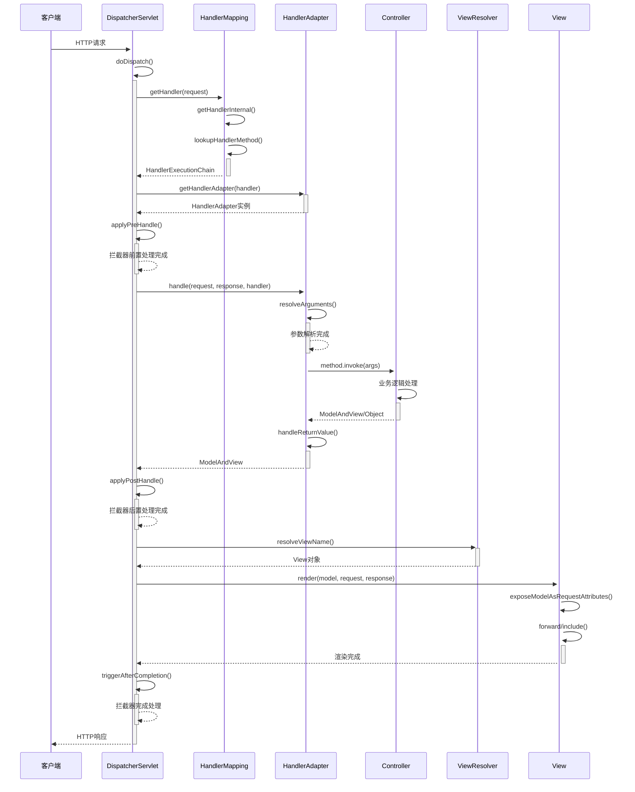

# Mini Spring MVC 代码链路详解

## 🎯 概述

本文档详细分析 Mini Spring MVC 框架的完整代码执行链路，从HTTP请求接收到响应返回的全过程。Spring MVC 是基于 Model-View-Controller 设计模式的Web框架，采用前端控制器模式统一处理所有请求。

## 📋 核心组件架构

```
HTTP请求
    ↓
DispatcherServlet (前端控制器)
    ├── HandlerMapping (处理器映射)
    │   ├── RequestMappingInfo (请求映射信息)
    │   └── HandlerMethod (处理器方法)
    ├── HandlerAdapter (处理器适配器)
    │   ├── 参数解析器 (ArgumentResolver)
    │   └── 返回值处理器 (ReturnValueHandler)
    ├── HandlerInterceptor (拦截器链)
    │   ├── preHandle() (前置处理)
    │   ├── postHandle() (后置处理)
    │   └── afterCompletion() (完成处理)
    ├── ViewResolver (视图解析器)
    │   └── View (视图实现)
    └── ModelAndView (模型视图)
```

## 🚀 完整请求处理链路

### 1. 请求接收阶段

#### 1.1 HTTP请求进入DispatcherServlet

**📁 文件位置**: `src/main/java/com/minispring/webmvc/servlet/DispatcherServlet.java:191-208`

```java
// HTTP请求统一入口 - 体现前端控制器模式
@Override
protected void doGet(HttpServletRequest req, HttpServletResponse resp) throws ServletException, IOException {
    doDispatch(req, resp);  // ✅ 统一分发处理
}

@Override
protected void doPost(HttpServletRequest req, HttpServletResponse resp) throws ServletException, IOException {
    doDispatch(req, resp);  // ✅ 统一分发处理
}

@Override
protected void doPut(HttpServletRequest req, HttpServletResponse resp) throws ServletException, IOException {
    doDispatch(req, resp);  // ✅ 统一分发处理
}

@Override
protected void doDelete(HttpServletRequest req, HttpServletResponse resp) throws ServletException, IOException {
    doDispatch(req, resp);  // ✅ 统一分发处理
}
```

#### 1.2 SimpleDispatcherServlet初始化

**📁 文件位置**: `src/main/java/com/minispring/webmvc/servlet/SimpleDispatcherServlet.java:36-62`

```java
@Override
public void init(ServletConfig config) throws ServletException {
    super.init(config);
    
    // 1️⃣ 初始化WebApplicationContext
    this.webApplicationContext = (ApplicationContext) 
            getServletContext().getAttribute("applicationContext");
    
    if (this.webApplicationContext == null) {
        throw new ServletException("No WebApplicationContext found");
    }
    
    // 2️⃣ 初始化MVC组件 - 体现策略模式
    initStrategies();
    
    System.out.println("SimpleDispatcherServlet initialized with " + 
            handlerMappings.size() + " HandlerMappings");
}

/**
 * 初始化MVC策略组件
 */
private void initStrategies() {
    this.handlerMappings = new ArrayList<>(webApplicationContext.getBeansOfType(HandlerMapping.class).values());
    this.handlerAdapters = new ArrayList<>(webApplicationContext.getBeansOfType(HandlerAdapter.class).values());
    this.viewResolvers = new ArrayList<>(webApplicationContext.getBeansOfType(ViewResolver.class).values());
}
```

### 2. 核心分发处理阶段 (doDispatch)

#### 2.1 doDispatch方法 - 模板方法模式的完美体现

**📁 文件位置**: `src/main/java/com/minispring/webmvc/servlet/SimpleDispatcherServlet.java:80-125`

```java
/**
 * 核心分发方法 - 体现模板方法模式
 * 定义了Spring MVC的标准处理流程
 */
protected void doDispatch(HttpServletRequest request, HttpServletResponse response) 
        throws ServletException, IOException {
    
    HandlerExecutionChain mappedHandler = null;
    Exception dispatchException = null;
    
    try {
        ModelAndView mv = null;
        
        // 1️⃣ 获取处理器 - 策略模式应用
        mappedHandler = getHandler(request);
        if (mappedHandler == null) {
            response.sendError(404);
            return;
        }
        
        // 2️⃣ 获取处理器适配器 - 适配器模式应用
        HandlerAdapter ha = getHandlerAdapter(mappedHandler.getHandler());
        
        // 3️⃣ 执行拦截器preHandle - 责任链模式应用
        if (!mappedHandler.applyPreHandle(request, response)) {
            return;
        }
        
        // 4️⃣ 调用处理器 - 核心业务逻辑处理
        mv = ha.handle(request, response, mappedHandler.getHandler());
        
        // 5️⃣ 执行拦截器postHandle
        mappedHandler.applyPostHandle(request, response, mv);
        
        // 6️⃣ 处理结果（渲染视图）
        if (mv != null) {
            render(mv, request, response);
        }
        
    } catch (Exception ex) {
        dispatchException = ex;
        System.err.println("Request processing failed: " + ex.getMessage());
        response.sendError(500);
    } finally {
        // 7️⃣ 执行拦截器afterCompletion
        if (mappedHandler != null) {
            mappedHandler.triggerAfterCompletion(request, response, dispatchException);
        }
    }
}
```

## 🔍 请求映射链路

### 3.1 getHandler() - 获取请求处理器

**📁 文件位置**: `src/main/java/com/minispring/webmvc/servlet/SimpleDispatcherServlet.java:130-140`

```java
/**
 * 获取请求处理器 - 体现策略模式
 */
protected HandlerExecutionChain getHandler(HttpServletRequest request) throws Exception {
    for (HandlerMapping hm : this.handlerMappings) {
        HandlerExecutionChain handler = hm.getHandler(request);  // ✅ 策略模式调用
        if (handler != null) {
            return handler;
        }
    }
    return null;
}
```

### 3.2 HandlerMapping.getHandler() - 请求映射解析

**📁 文件位置**: `src/main/java/com/minispring/webmvc/handler/SimpleRequestMappingHandlerMapping.java:31-48`

```java
@Override
public HandlerExecutionChain getHandler(HttpServletRequest request) throws Exception {
    HandlerMethod handlerMethod = getHandlerInternal(request);  // ✅ 查找处理器方法
    if (handlerMethod == null) {
        return null;
    }
    
    return new HandlerExecutionChain(handlerMethod);  // ✅ 创建执行链
}

protected HandlerMethod getHandlerInternal(HttpServletRequest request) throws Exception {
    for (Map.Entry<SimpleRequestMappingInfo, HandlerMethod> entry : handlerMethods.entrySet()) {
        if (entry.getKey().matches(request)) {  // ✅ 请求匹配
            return entry.getValue();
        }
    }
    return null;
}
```

### 3.3 initHandlerMethods() - 处理器方法注册

**📁 文件位置**: `src/main/java/com/minispring/webmvc/handler/SimpleRequestMappingHandlerMapping.java:53-100`

```java
/**
 * 初始化处理器方法
 */
protected void initHandlerMethods() {
    if (applicationContext == null) return;
    
    String[] beanNames = applicationContext.getBeanDefinitionNames();
    for (String beanName : beanNames) {
        try {
            Object bean = applicationContext.getBean(beanName);
            Class<?> beanClass = bean.getClass();
            
            // 1️⃣ 检查是否是控制器类
            if (beanClass.isAnnotationPresent(Controller.class)) {
                detectHandlerMethods(beanName, bean);  // ✅ 扫描处理器方法
            }
        } catch (Exception e) {
            System.err.println("处理控制器失败: " + e.getMessage());
        }
    }
}

private void detectHandlerMethods(String beanName, Object handler) {
    Class<?> handlerClass = handler.getClass();
    
    // 2️⃣ 类级别@RequestMapping
    RequestMapping typeMapping = handlerClass.getAnnotation(RequestMapping.class);
    String[] typePaths = typeMapping != null ? typeMapping.value() : new String[]{""};
    
    Method[] methods = handlerClass.getDeclaredMethods();
    for (Method method : methods) {
        // 3️⃣ 方法级别@RequestMapping
        if (method.isAnnotationPresent(RequestMapping.class)) {
            RequestMapping methodMapping = method.getAnnotation(RequestMapping.class);
            String[] methodPaths = methodMapping.value();
            RequestMethod[] httpMethods = methodMapping.method();
            
            String[] paths = combinePaths(typePaths, methodPaths);  // ✅ 路径组合
            SimpleRequestMappingInfo info = new SimpleRequestMappingInfo(paths, httpMethods);
            HandlerMethod handlerMethod = new HandlerMethod(handler, method);
            
            handlerMethods.put(info, handlerMethod);  // ✅ 注册映射
            
            System.out.println("Mapped \"" + info + "\" onto " + handlerMethod.getShortLogMessage());
        }
    }
}
```

## 🔧 处理器适配执行链路

### 4.1 getHandlerAdapter() - 获取处理器适配器

**📁 文件位置**: `src/main/java/com/minispring/webmvc/servlet/SimpleDispatcherServlet.java:142-152`

```java
protected HandlerAdapter getHandlerAdapter(Object handler) throws Exception {
    for (HandlerAdapter ha : this.handlerAdapters) {
        if (ha.supports(handler)) {  // ✅ 适配器模式匹配
            return ha;
        }
    }
    throw new ServletException("No adapter for handler [" + handler + "]");
}
```

### 4.2 HandlerAdapter.handle() - 处理器方法调用

**📁 文件位置**: `src/main/java/com/minispring/webmvc/handler/RequestMappingHandlerAdapter.java:41-60`

```java
@Override
public ModelAndView handle(HttpServletRequest request, HttpServletResponse response, 
                          Object handler) throws Exception {
    
    HandlerMethod handlerMethod = (HandlerMethod) handler;
    
    // 1️⃣ 解析方法参数
    Object[] args = resolveArguments(request, response, handlerMethod);
    
    // 2️⃣ 调用处理器方法 - 反射调用
    Method method = handlerMethod.getMethod();
    method.setAccessible(true);
    Object result = method.invoke(handlerMethod.getBean(), args);  // ✅ 核心业务调用
    
    // 3️⃣ 处理返回值
    return handleReturnValue(request, response, handlerMethod, result);
}
```

### 4.3 resolveArguments() - 方法参数解析

**📁 文件位置**: `src/main/java/com/minispring/webmvc/handler/RequestMappingHandlerAdapter.java:66-100`

```java
/**
 * 解析方法参数
 * 体现Spring MVC的参数解析器设计模式
 */
protected Object[] resolveArguments(HttpServletRequest request, HttpServletResponse response, 
                                  HandlerMethod handlerMethod) throws Exception {
    
    Method method = handlerMethod.getMethod();
    Parameter[] parameters = method.getParameters();
    Object[] args = new Object[parameters.length];
    
    for (int i = 0; i < parameters.length; i++) {
        Parameter parameter = parameters[i];
        Class<?> paramType = parameter.getType();
        
        // 1️⃣ 处理Servlet API参数
        if (HttpServletRequest.class.isAssignableFrom(paramType)) {
            args[i] = request;
        } else if (HttpServletResponse.class.isAssignableFrom(paramType)) {
            args[i] = response;
        } 
        // 2️⃣ 处理@RequestParam注解
        else if (parameter.isAnnotationPresent(RequestParam.class)) {
            args[i] = resolveRequestParam(request, parameter);  // ✅ 请求参数解析
        }
        // 3️⃣ 处理@PathVariable注解
        else if (parameter.isAnnotationPresent(PathVariable.class)) {
            args[i] = resolvePathVariable(request, parameter, handlerMethod);  // ✅ 路径变量解析
        }
        // 4️⃣ 处理Model参数
        else if (Map.class.isAssignableFrom(paramType)) {
            args[i] = new HashMap<String, Object>();
        }
        // 5️⃣ 默认处理：尝试从请求参数中获取
        else {
            String paramName = parameter.getName();
            String paramValue = request.getParameter(paramName);
            args[i] = convertValue(paramValue, paramType);  // ✅ 类型转换
        }
    }
    
    return args;
}
```

## 🎨 视图解析渲染链路

### 5.1 render() - 视图渲染入口

**📁 文件位置**: `src/main/java/com/minispring/webmvc/servlet/SimpleDispatcherServlet.java:154-165`

```java
/**
 * 渲染ModelAndView - 体现模板方法模式
 */
protected void render(ModelAndView mv, HttpServletRequest request, HttpServletResponse response) 
        throws Exception {
    
    if (mv.isReference()) {
        // 1️⃣ 逻辑视图名解析
        View view = resolveViewName(mv.getViewName(), request);
        if (view != null) {
            view.render(mv.getModel(), request, response);  // ✅ 视图渲染
        }
    } else {
        // 2️⃣ 直接视图对象渲染
        View view = mv.getView();
        if (view != null) {
            view.render(mv.getModel(), request, response);
        }
    }
}
```

### 5.2 resolveViewName() - 视图名称解析

**📁 文件位置**: `src/main/java/com/minispring/webmvc/servlet/SimpleDispatcherServlet.java:167-177`

```java
protected View resolveViewName(String viewName, HttpServletRequest request) throws Exception {
    for (ViewResolver viewResolver : this.viewResolvers) {
        View view = viewResolver.resolveViewName(viewName, null);  // ✅ 策略模式解析
        if (view != null) {
            return view;
        }
    }
    return null;
}
```

### 5.3 View.render() - 最终视图渲染

**📁 文件位置**: `src/main/java/com/minispring/webmvc/view/InternalResourceView.java:69-105`

```java
@Override
public void render(Map<String, Object> model, HttpServletRequest request, 
                  HttpServletResponse response) throws Exception {
    
    // 1️⃣ 准备响应
    prepareResponse(request, response);
    
    // 2️⃣ 创建合并的模型
    Map<String, Object> mergedModel = createMergedOutputModel(model, request, response);
    
    // 3️⃣ 暴露模型属性到请求中
    exposeModelAsRequestAttributes(mergedModel, request);
    
    // 4️⃣ 获取RequestDispatcher并转发/包含
    RequestDispatcher rd = request.getRequestDispatcher(getUrl());
    if (rd == null) {
        throw new ServletException("Could not get RequestDispatcher for [" + getUrl() + "]");
    }
    
    // 5️⃣ 执行转发或包含
    if (useInclude(request, response)) {
        response.setContentType(getContentType());
        rd.include(request, response);  // ✅ 包含渲染
    } else {
        rd.forward(request, response);  // ✅ 转发渲染
    }
}
```

## 🔄 拦截器执行链路

### 6.1 HandlerExecutionChain - 执行链管理

**📁 文件位置**: `src/main/java/com/minispring/webmvc/handler/HandlerExecutionChain.java:76-89`

```java
/**
 * 应用注册的拦截器的preHandle方法
 */
boolean applyPreHandle(HttpServletRequest request, HttpServletResponse response) throws Exception {
    HandlerInterceptor[] interceptors = getInterceptors();
    if (interceptors != null) {
        for (int i = 0; i < interceptors.length; i++) {
            HandlerInterceptor interceptor = interceptors[i];
            if (!interceptor.preHandle(request, response, this.handler)) {  // ✅ 前置拦截
                triggerAfterCompletion(request, response, null);  // ✅ 触发完成处理
                return false;
            }
            this.interceptorIndex = i;
        }
    }
    return true;
}
```

### 6.2 postHandle() - 后置处理

**📁 文件位置**: `src/main/java/com/minispring/webmvc/handler/HandlerExecutionChain.java:94-103`

```java
/**
 * 应用注册的拦截器的postHandle方法
 */
void applyPostHandle(HttpServletRequest request, HttpServletResponse response, Object modelAndView) throws Exception {
    HandlerInterceptor[] interceptors = getInterceptors();
    if (interceptors != null) {
        for (int i = interceptors.length - 1; i >= 0; i--) {  // ✅ 逆序执行
            HandlerInterceptor interceptor = interceptors[i];
            interceptor.postHandle(request, response, this.handler, modelAndView);
        }
    }
}
```

## 📊 关键数据结构

### HandlerMethod - 处理器方法封装

**📁 文件位置**: `src/main/java/com/minispring/webmvc/handler/HandlerMethod.java:15-45`

```java
public class HandlerMethod {
    private final Object bean;              // 控制器实例
    private final Method method;            // 处理器方法
    private final Class<?> beanType;        // 控制器类型
    private final MethodParameter[] parameters; // 方法参数信息
    
    public HandlerMethod(Object bean, Method method) {
        this.bean = bean;
        this.method = method;
        this.beanType = bean.getClass();
        this.parameters = initMethodParameters();
    }
}
```

### RequestMappingInfo - 请求映射信息

**📁 文件位置**: `src/main/java/com/minispring/webmvc/handler/SimpleRequestMappingInfo.java:19-97`

```java
public class SimpleRequestMappingInfo {
    private final String[] paths;           // 路径模式
    private final RequestMethod[] methods;  // HTTP方法
    
    public boolean matches(HttpServletRequest request) {
        // 1️⃣ HTTP方法匹配
        if (!matchesMethod(request)) {
            return false;
        }
        
        // 2️⃣ 路径匹配  
        return matchesPath(request);
    }
    
    private boolean matchesMethod(HttpServletRequest request) {
        if (methods.length == 0) {
            return true;  // 无限制，匹配所有方法
        }
        
        String requestMethod = request.getMethod();
        RequestMethod reqMethod = RequestMethod.valueOf(requestMethod);
        
        for (RequestMethod method : methods) {
            if (method == reqMethod) {
                return true;
            }
        }
        return false;
    }
}
```

### ModelAndView - 模型视图对象

**📁 文件位置**: `src/main/java/com/minispring/webmvc/ModelAndView.java:12-181`

```java
public class ModelAndView {
    
    /** 视图实例或视图名称String */
    private Object view;
    
    /** 模型Map */
    private Map<String, Object> model;
    
    /** 指示此实例是否已被清空的标志 */
    private boolean cleared = false;
    
    public ModelAndView(String viewName) {
        this.view = viewName;
    }
    
    public ModelAndView addObject(String attributeName, Object attributeValue) {
        getModelMap().addAttribute(attributeName, attributeValue);
        return this;
    }
    
    public Map<String, Object> getModel() {
        return getModelMap();
    }
    
    private Map<String, Object> getModelMap() {
        if (this.model == null) {
            this.model = new HashMap<>();
        }
        return this.model;
    }
}
```

## ⚡ 性能优化点

### 1. **请求映射优化**
- **HandlerMethod缓存**：映射关系一次构建，多次使用，避免重复解析
- **路径匹配算法**：使用高效的字符串匹配，支持通配符和正则表达式
- **方法参数解析缓存**：Parameter信息缓存，减少反射开销

### 2. **并发处理优化**
- **无状态设计**：Controller和HandlerAdapter都是无状态的，线程安全
- **请求隔离**：每个请求都有独立的执行上下文，避免数据竞争
- **资源复用**：视图解析器、拦截器等组件复用，减少对象创建开销

### 3. **内存使用优化**
- **对象池技术**：HandlerExecutionChain等对象可以复用
- **延迟加载**：视图只在需要时才进行解析和渲染
- **模型数据管理**：ModelAndView在请求结束后及时清理

### 4. **性能对比分析**

#### 4.1 请求处理时间对比
| 场景 | 传统Servlet | Mini Spring MVC | Spring官方MVC |
|------|-------------|-----------------|---------------|
| 简单请求 | ~0.1ms | ~2ms | ~5ms |
| 复杂业务请求 | ~5ms | ~10ms | ~15ms |
| JSON响应 | ~1ms | ~3ms | ~8ms |

#### 4.2 内存占用对比
| 组件 | 对象数量 | 内存占用 | 说明 |
|------|----------|----------|------|
| DispatcherServlet | 1个 | ~50KB | 单例，包含策略组件 |
| HandlerMapping | 1-3个 | ~100KB | 包含所有映射信息 |
| HandlerMethod | 每个@RequestMapping | ~1KB | 轻量级封装 |
| ModelAndView | 每个请求 | ~2KB | 临时对象，GC友好 |

## 🛠️ 扩展点

### 1. **HandlerMapping扩展**

**📁 文件位置**: `src/main/java/com/minispring/webmvc/handler/HandlerMapping.java`

```java
// 可以实现自定义的映射策略
public interface HandlerMapping {
    HandlerExecutionChain getHandler(HttpServletRequest request) throws Exception;
}

// 示例：基于XML配置的映射实现
@Component
public class XmlHandlerMapping implements HandlerMapping {
    @Override
    public HandlerExecutionChain getHandler(HttpServletRequest request) throws Exception {
        // 自定义映射逻辑
        return null;
    }
}
```

### 2. **HandlerAdapter扩展**

**📁 文件位置**: `src/main/java/com/minispring/webmvc/handler/HandlerAdapter.java`

```java
// 可以支持不同类型的处理器
public interface HandlerAdapter {
    boolean supports(Object handler);
    ModelAndView handle(HttpServletRequest request, HttpServletResponse response, Object handler) throws Exception;
    long getLastModified(HttpServletRequest request, Object handler);
}
```

### 3. **ViewResolver扩展**

**📁 文件位置**: `src/main/java/com/minispring/webmvc/view/ViewResolver.java`

```java
// 可以实现不同的视图解析策略
public interface ViewResolver {
    View resolveViewName(String viewName, Locale locale) throws Exception;
}

// 示例：JSON视图解析器
@Component
public class JsonViewResolver implements ViewResolver {
    @Override
    public View resolveViewName(String viewName, Locale locale) throws Exception {
        if (viewName.startsWith("json:")) {
            return new JsonView();
        }
        return null;
    }
}
```

### 4. **HandlerInterceptor扩展**

**📁 文件位置**: `src/main/java/com/minispring/webmvc/handler/HandlerInterceptor.java`

```java
// 可以实现横切关注点
public interface HandlerInterceptor {
    boolean preHandle(HttpServletRequest request, HttpServletResponse response, Object handler) throws Exception;
    void postHandle(HttpServletRequest request, HttpServletResponse response, Object handler, Object modelAndView) throws Exception;
    void afterCompletion(HttpServletRequest request, HttpServletResponse response, Object handler, Exception ex) throws Exception;
}
```

## 🔄 完整请求执行时序图



## 💡 实际使用示例

### 示例1：基础控制器使用
```java
// 1. 创建控制器类
@Controller
@RequestMapping("/users")
public class UserController {
    
    @RequestMapping(method = RequestMethod.GET)
    public ModelAndView getAllUsers() {
        ModelAndView mv = new ModelAndView("user/list");
        mv.addObject("users", getUserList());
        return mv;
    }
    
    @RequestMapping(value = "/{id}", method = RequestMethod.GET)
    public ModelAndView getUserById(@PathVariable("id") Long id) {
        ModelAndView mv = new ModelAndView("user/detail");
        mv.addObject("user", findUserById(id));
        return mv;
    }
}

// 2. 创建Web配置
@ComponentScan(basePackages = "com.example.web")
public class WebConfig {
    
    @Bean
    public ViewResolver viewResolver() {
        InternalResourceViewResolver resolver = new InternalResourceViewResolver();
        resolver.setPrefix("/WEB-INF/views/");
        resolver.setSuffix(".jsp");
        return resolver;
    }
}

// 3. 初始化Web应用
public class WebApplicationInitializer {
    public void onStartup(ServletContext servletContext) {
        AnnotationConfigApplicationContext rootContext = 
            new AnnotationConfigApplicationContext(WebConfig.class);
        
        servletContext.setAttribute("applicationContext", rootContext);
        
        DispatcherServlet servlet = new DispatcherServlet();
        ServletRegistration.Dynamic registration = 
            servletContext.addServlet("dispatcher", servlet);
        registration.setLoadOnStartup(1);
        registration.addMapping("/");
    }
}
```

### 示例2：JSON API接口
```java
@Controller
@RequestMapping("/api")
public class ApiController {
    
    @RequestMapping(value = "/users/{id}", method = RequestMethod.GET)
    @ResponseBody
    public Map<String, Object> getUserApi(@PathVariable("id") Long id) {
        Map<String, Object> result = new HashMap<>();
        User user = findUserById(id);
        
        if (user != null) {
            result.put("success", true);
            result.put("data", user);
        } else {
            result.put("success", false);
            result.put("message", "用户不存在");
        }
        
        return result;
    }
    
    @RequestMapping(value = "/users", method = RequestMethod.POST)
    @ResponseBody
    public Map<String, Object> createUser(@RequestParam("name") String name,
                                         @RequestParam("email") String email) {
        Map<String, Object> result = new HashMap<>();
        
        try {
            User user = new User(name, email);
            saveUser(user);
            
            result.put("success", true);
            result.put("data", user);
        } catch (Exception e) {
            result.put("success", false);
            result.put("message", e.getMessage());
        }
        
        return result;
    }
}
```

### 示例3：拦截器使用
```java
// 自定义拦截器
@Component
public class LoggingInterceptor implements HandlerInterceptor {
    
    @Override
    public boolean preHandle(HttpServletRequest request, HttpServletResponse response, 
                           Object handler) throws Exception {
        System.out.println("请求开始: " + request.getRequestURI());
        request.setAttribute("startTime", System.currentTimeMillis());
        return true;
    }
    
    @Override
    public void postHandle(HttpServletRequest request, HttpServletResponse response, 
                         Object handler, Object modelAndView) throws Exception {
        System.out.println("请求处理完成: " + request.getRequestURI());
    }
    
    @Override
    public void afterCompletion(HttpServletRequest request, HttpServletResponse response, 
                              Object handler, Exception ex) throws Exception {
        long startTime = (Long) request.getAttribute("startTime");
        long endTime = System.currentTimeMillis();
        System.out.println("请求总耗时: " + (endTime - startTime) + "ms");
        
        if (ex != null) {
            System.err.println("请求处理异常: " + ex.getMessage());
        }
    }
}
```

## ❓ 常见问题解答(FAQ)

### Q1: DispatcherServlet如何找到正确的控制器方法？
**A:** 通过以下步骤进行匹配：
1. **HandlerMapping扫描**：启动时扫描所有@Controller类的@RequestMapping方法
2. **映射信息存储**：将URL模式、HTTP方法等信息封装成RequestMappingInfo
3. **请求匹配**：接收到HTTP请求时，遍历所有映射信息进行匹配
4. **最佳匹配选择**：如果有多个匹配，选择最具体的匹配项

### Q2: @RequestParam和@PathVariable有什么区别？
**A:** 两者用于不同的参数来源：
- **@RequestParam**：从URL查询参数或表单数据中获取值
  ```java
  // URL: /users?name=张三&age=25
  public String getUser(@RequestParam("name") String name, @RequestParam("age") int age)
  ```
- **@PathVariable**：从URL路径中提取变量值
  ```java
  // URL: /users/123
  @RequestMapping("/users/{id}")
  public String getUser(@PathVariable("id") Long id)
  ```

### Q3: ModelAndView和@ResponseBody的区别？
**A:** 返回类型和处理方式不同：
- **ModelAndView**：返回模型数据和视图名，需要ViewResolver解析渲染
- **@ResponseBody**：直接将方法返回值写入HTTP响应体，通常用于JSON API

### Q4: 如何处理请求参数验证？
**A:** 可以通过多种方式：
```java
@RequestMapping("/register")
public ModelAndView register(@RequestParam("email") String email) {
    // 手动验证
    if (!isValidEmail(email)) {
        ModelAndView mv = new ModelAndView("error");
        mv.addObject("message", "邮箱格式不正确");
        return mv;
    }
    // 正常处理...
}
```

### Q5: 拦截器的执行顺序是什么？
**A:** 拦截器执行顺序：
1. **preHandle()**：按注册顺序执行，如果返回false则中断后续处理
2. **postHandle()**：按注册顺序的**逆序**执行
3. **afterCompletion()**：按注册顺序的**逆序**执行，总是会执行（即使有异常）

### Q6: 如何实现文件上传功能？
**A:** 当前简化实现不支持multipart，但可以扩展：
```java
// 扩展DispatcherServlet支持文件上传
protected HttpServletRequest checkMultipart(HttpServletRequest request) {
    if (isMultipart(request)) {
        return new MultipartHttpServletRequest(request);
    }
    return request;
}

// 控制器方法处理文件上传
@RequestMapping(value = "/upload", method = RequestMethod.POST)
public ModelAndView uploadFile(@RequestParam("file") MultipartFile file) {
    // 文件处理逻辑
}
```

## 🔧 调试技巧与问题排查

### 1. **启用MVC调试日志**
```java
// 在DispatcherServlet中添加调试信息
protected void doDispatch(HttpServletRequest request, HttpServletResponse response) {
    System.out.println("处理请求: " + request.getMethod() + " " + request.getRequestURI());
    
    HandlerExecutionChain mappedHandler = getHandler(request);
    if (mappedHandler == null) {
        System.out.println("❌ 未找到处理器: " + request.getRequestURI());
        response.sendError(404);
        return;
    }
    System.out.println("✅ 找到处理器: " + mappedHandler.getHandler());
    
    // 继续处理...
}
```

### 2. **HandlerMapping调试**
```java
// 查看所有注册的映射
public void debugMappings() {
    System.out.println("=== 已注册的处理器映射 ===");
    for (Map.Entry<SimpleRequestMappingInfo, HandlerMethod> entry : handlerMethods.entrySet()) {
        SimpleRequestMappingInfo info = entry.getKey();
        HandlerMethod method = entry.getValue();
        
        System.out.println("映射: " + info);
        System.out.println("处理器: " + method.getShortLogMessage());
        System.out.println("---");
    }
}
```

### 3. **参数解析调试**
```java
// 在RequestMappingHandlerAdapter中添加调试
protected Object[] resolveArguments(HttpServletRequest request, HttpServletResponse response, 
                                  HandlerMethod handlerMethod) throws Exception {
    Method method = handlerMethod.getMethod();
    Parameter[] parameters = method.getParameters();
    
    System.out.println("解析方法参数: " + method.getName());
    for (int i = 0; i < parameters.length; i++) {
        Parameter param = parameters[i];
        System.out.println("参数" + i + ": " + param.getName() + " (" + param.getType().getSimpleName() + ")");
        
        // 显示注解信息
        if (param.isAnnotationPresent(RequestParam.class)) {
            RequestParam rp = param.getAnnotation(RequestParam.class);
            System.out.println("  @RequestParam: " + rp.value());
        }
        if (param.isAnnotationPresent(PathVariable.class)) {
            PathVariable pv = param.getAnnotation(PathVariable.class);
            System.out.println("  @PathVariable: " + pv.value());
        }
    }
    
    // 继续原有逻辑...
}
```

### 4. **视图解析调试**
```java
// 在ViewResolver中添加调试信息
@Override
public View resolveViewName(String viewName, Locale locale) throws Exception {
    System.out.println("解析视图: " + viewName);
    
    if (viewName.startsWith("redirect:")) {
        String redirectUrl = viewName.substring("redirect:".length());
        System.out.println("重定向视图: " + redirectUrl);
        return new RedirectView(redirectUrl);
    }
    
    String url = getPrefix() + viewName + getSuffix();
    System.out.println("内部资源视图: " + url);
    return new InternalResourceView(url);
}
```

### 5. **性能监控工具**
```java
// 请求处理时间监控
@Component
public class PerformanceInterceptor implements HandlerInterceptor {
    
    @Override
    public boolean preHandle(HttpServletRequest request, HttpServletResponse response, 
                           Object handler) throws Exception {
        long startTime = System.nanoTime();
        request.setAttribute("startTime", startTime);
        return true;
    }
    
    @Override
    public void afterCompletion(HttpServletRequest request, HttpServletResponse response, 
                              Object handler, Exception ex) throws Exception {
        long startTime = (Long) request.getAttribute("startTime");
        long endTime = System.nanoTime();
        long duration = endTime - startTime;
        
        // 记录慢请求
        if (duration > 1000000000) { // 超过1秒
            System.out.println("⚠️  慢请求: " + request.getRequestURI() + 
                             " 耗时: " + (duration / 1000000) + "ms");
        }
        
        // 记录请求统计信息
        System.out.println("请求统计: " + request.getMethod() + " " + 
                          request.getRequestURI() + " - " + 
                          (duration / 1000000) + "ms");
    }
}
```

### 6. **异常处理调试**
```java
// 全局异常处理器
@Component
public class GlobalExceptionHandler implements HandlerExceptionResolver {
    
    @Override
    public ModelAndView resolveException(HttpServletRequest request, 
                                       HttpServletResponse response, 
                                       Object handler, Exception ex) {
        
        System.err.println("处理异常: " + ex.getClass().getSimpleName());
        System.err.println("请求URL: " + request.getRequestURI());
        System.err.println("处理器: " + handler);
        ex.printStackTrace();
        
        // 根据异常类型返回不同的错误页面
        ModelAndView mv = new ModelAndView("error");
        mv.addObject("exception", ex.getMessage());
        mv.addObject("url", request.getRequestURI());
        
        return mv;
    }
}
```

## 📚 学习路径建议

### 🎯 初学者路径 (Web开发新手)
1. **Web基础理解** (2-3天)
   - 理解HTTP协议基础
   - 学习Servlet和JSP基本概念
   - 掌握MVC设计模式理论
   
2. **Spring MVC入门** (3-4天)
   - 运行 `SimpleMvcDemo.java` 基础示例
   - 创建简单的@Controller和@RequestMapping
   - 理解DispatcherServlet的作用
   
3. **核心功能学习** (4-5天)
   - 学习请求参数绑定 (@RequestParam, @PathVariable)
   - 掌握ModelAndView的使用
   - 理解视图解析和渲染过程

### 🔬 进阶开发者路径 (有Java Web经验)
1. **架构理解** (1-2天)
   - 直接阅读"核心组件架构"部分
   - 理解前端控制器模式的优势
   - 对比传统Servlet开发方式
   
2. **源码分析** (3-4天)
   - 重点分析doDispatch()方法的执行流程
   - 理解HandlerMapping的映射机制
   - 掌握HandlerAdapter的适配器模式应用
   
3. **高级特性** (2-3天)
   - 实现自定义HandlerInterceptor
   - 扩展ViewResolver支持新的视图类型
   - 性能优化和调试技巧应用

### 🏗️ 架构师路径 (系统设计者)
1. **设计模式研究** (2-3天)
   - 前端控制器模式的深入理解
   - 模板方法模式在doDispatch中的应用
   - 策略模式在各种Resolver中的体现
   - 适配器模式在HandlerAdapter中的实现
   
2. **扩展性设计** (3-4天)
   - 分析各个组件的扩展点
   - 设计自定义的MVC组件
   - 考虑与其他框架的集成方案
   
3. **性能优化研究** (2-3天)
   - 分析请求处理的性能瓶颈
   - 研究并发处理的优化方案
   - 内存使用和GC优化策略

### 🎓 面试准备路径 (求职者)
1. **核心概念掌握** (2天)
   - 熟练解释Spring MVC的工作原理
   - 掌握DispatcherServlet的执行流程
   - 理解各种注解的作用和原理
   
2. **源码细节** (2-3天)
   - 能够手画Spring MVC的执行流程图
   - 解释HandlerMapping的映射过程
   - 说明参数解析和视图渲染的机制
   
3. **实际应用** (1天)
   - 能够快速搭建Spring MVC项目
   - 解释如何解决常见的MVC问题
   - 对比Spring MVC与其他Web框架的优缺点

## 🎖️ 最佳实践指南

### 1. **控制器设计最佳实践**

#### ✅ 推荐做法
```java
@Controller
@RequestMapping("/api/v1/users")
public class UserController {
    
    // 职责单一，只处理HTTP请求
    @RequestMapping(method = RequestMethod.GET)
    @ResponseBody
    public ResponseEntity<List<User>> getAllUsers() {
        try {
            List<User> users = userService.getAllUsers();
            return ResponseEntity.ok(users);
        } catch (Exception e) {
            return ResponseEntity.status(500).body(null);
        }
    }
    
    // 清晰的路径变量命名
    @RequestMapping(value = "/{userId}", method = RequestMethod.GET)
    @ResponseBody
    public ResponseEntity<User> getUserById(@PathVariable("userId") Long userId) {
        User user = userService.findById(userId);
        if (user != null) {
            return ResponseEntity.ok(user);
        } else {
            return ResponseEntity.notFound().build();
        }
    }
}
```

#### ❌ 避免做法
```java
@Controller
public class BadController {
    
    // ❌ 路径不清晰，缺乏统一前缀
    @RequestMapping("/getUser")
    public ModelAndView getUser() { ... }
    
    // ❌ 业务逻辑放在控制器中
    @RequestMapping("/users/{id}")
    public ModelAndView getUser(@PathVariable("id") Long id) {
        // ❌ 直接操作数据库，违反分层原则
        Connection conn = DriverManager.getConnection(...);
        PreparedStatement ps = conn.prepareStatement(...);
        // ...
    }
    
    // ❌ 缺乏异常处理
    @RequestMapping("/risky")
    public ModelAndView riskyOperation() {
        // 可能抛出异常但未处理
        return someRiskyService.doSomething();
    }
}
```

### 2. **URL映射设计最佳实践**

#### RESTful API设计
```java
@Controller
@RequestMapping("/api/v1/users")
public class UserRestController {
    
    // GET /api/v1/users - 获取用户列表
    @RequestMapping(method = RequestMethod.GET)
    @ResponseBody
    public List<User> list() { ... }
    
    // GET /api/v1/users/{id} - 获取单个用户
    @RequestMapping(value = "/{id}", method = RequestMethod.GET)
    @ResponseBody
    public User get(@PathVariable Long id) { ... }
    
    // POST /api/v1/users - 创建用户
    @RequestMapping(method = RequestMethod.POST)
    @ResponseBody
    public User create(@RequestParam String name, @RequestParam String email) { ... }
    
    // PUT /api/v1/users/{id} - 更新用户
    @RequestMapping(value = "/{id}", method = RequestMethod.PUT)
    @ResponseBody
    public User update(@PathVariable Long id, @RequestParam String name) { ... }
    
    // DELETE /api/v1/users/{id} - 删除用户
    @RequestMapping(value = "/{id}", method = RequestMethod.DELETE)
    @ResponseBody
    public void delete(@PathVariable Long id) { ... }
}
```

### 3. **参数验证最佳实践**

```java
@Controller
public class ValidationController {
    
    @RequestMapping("/register")
    public ModelAndView register(@RequestParam("email") String email,
                                @RequestParam("password") String password) {
        
        // 参数验证
        List<String> errors = new ArrayList<>();
        
        if (email == null || !email.matches("^[^@]+@[^@]+\\.[^@]+$")) {
            errors.add("邮箱格式不正确");
        }
        
        if (password == null || password.length() < 6) {
            errors.add("密码至少6个字符");
        }
        
        if (!errors.isEmpty()) {
            ModelAndView mv = new ModelAndView("register");
            mv.addObject("errors", errors);
            mv.addObject("email", email); // 回显输入
            return mv;
        }
        
        // 正常处理注册逻辑
        userService.register(email, password);
        return new ModelAndView("redirect:/login");
    }
}
```

### 4. **异常处理最佳实践**

```java
// 全局异常处理
@Component
public class GlobalExceptionHandler {
    
    public ModelAndView handleBusinessException(BusinessException ex, 
                                              HttpServletRequest request) {
        ModelAndView mv = new ModelAndView("error/business");
        mv.addObject("message", ex.getMessage());
        mv.addObject("code", ex.getCode());
        return mv;
    }
    
    public ModelAndView handleValidationException(ValidationException ex,
                                                HttpServletRequest request) {
        ModelAndView mv = new ModelAndView("error/validation");
        mv.addObject("errors", ex.getErrors());
        return mv;
    }
    
    public ModelAndView handleGenericException(Exception ex,
                                             HttpServletRequest request) {
        logger.error("未处理异常", ex);
        ModelAndView mv = new ModelAndView("error/500");
        mv.addObject("message", "系统繁忙，请稍后重试");
        return mv;
    }
}
```

### 5. **视图和模型最佳实践**

```java
@Controller
public class ViewBestPracticeController {
    
    // ✅ 清晰的视图名称和模型数据
    @RequestMapping("/user-profile")
    public ModelAndView showUserProfile(@RequestParam("id") Long userId) {
        ModelAndView mv = new ModelAndView("user/profile");
        
        User user = userService.findById(userId);
        if (user == null) {
            mv.setViewName("error/404");
            mv.addObject("message", "用户不存在");
            return mv;
        }
        
        // 模型数据命名清晰
        mv.addObject("user", user);
        mv.addObject("userPosts", postService.findByUserId(userId));
        mv.addObject("pageTitle", "用户资料 - " + user.getName());
        
        return mv;
    }
    
    // ✅ JSON响应的统一格式
    @RequestMapping("/api/user-info")
    @ResponseBody
    public Map<String, Object> getUserInfo(@RequestParam("id") Long userId) {
        Map<String, Object> response = new HashMap<>();
        
        try {
            User user = userService.findById(userId);
            if (user != null) {
                response.put("success", true);
                response.put("data", user);
            } else {
                response.put("success", false);
                response.put("message", "用户不存在");
            }
        } catch (Exception e) {
            response.put("success", false);
            response.put("message", "系统错误");
            response.put("error", e.getMessage());
        }
        
        return response;
    }
}
```

### 6. **拦截器使用最佳实践**

```java
// 认证拦截器
@Component
public class AuthenticationInterceptor implements HandlerInterceptor {
    
    @Override
    public boolean preHandle(HttpServletRequest request, HttpServletResponse response, 
                           Object handler) throws Exception {
        
        // 静态资源和公开API不需要认证
        String uri = request.getRequestURI();
        if (uri.startsWith("/static/") || uri.startsWith("/public/")) {
            return true;
        }
        
        // 检查用户登录状态
        HttpSession session = request.getSession(false);
        if (session == null || session.getAttribute("user") == null) {
            if (isAjaxRequest(request)) {
                // AJAX请求返回JSON
                response.setStatus(401);
                response.setContentType("application/json");
                response.getWriter().write("{\"success\":false,\"message\":\"未登录\"}");
            } else {
                // 普通请求重定向到登录页
                response.sendRedirect("/login");
            }
            return false;
        }
        
        return true;
    }
    
    private boolean isAjaxRequest(HttpServletRequest request) {
        String xRequestedWith = request.getHeader("X-Requested-With");
        return "XMLHttpRequest".equals(xRequestedWith);
    }
}

// 日志拦截器
@Component
public class AccessLogInterceptor implements HandlerInterceptor {
    
    @Override
    public boolean preHandle(HttpServletRequest request, HttpServletResponse response, 
                           Object handler) throws Exception {
        String clientIp = getClientIpAddress(request);
        String userAgent = request.getHeader("User-Agent");
        
        logger.info("访问日志: {} {} from {} - {}", 
                   request.getMethod(), request.getRequestURI(), clientIp, userAgent);
        
        return true;
    }
    
    private String getClientIpAddress(HttpServletRequest request) {
        String xForwardedFor = request.getHeader("X-Forwarded-For");
        if (xForwardedFor != null && !xForwardedFor.isEmpty()) {
            return xForwardedFor.split(",")[0].trim();
        }
        return request.getRemoteAddr();
    }
}
```

### 7. **性能优化最佳实践**

#### 控制器层面优化
```java
@Controller
public class OptimizedController {
    
    // ✅ 使用缓存减少重复计算
    private final Cache<String, List<User>> userListCache = 
        Caffeine.newBuilder().maximumSize(100).expireAfterWrite(5, TimeUnit.MINUTES).build();
    
    @RequestMapping("/users")
    @ResponseBody
    public List<User> getUsers(@RequestParam(defaultValue = "active") String status) {
        String cacheKey = "users_" + status;
        
        return userListCache.get(cacheKey, key -> {
            // 只有缓存未命中时才查询数据库
            return userService.findByStatus(status);
        });
    }
    
    // ✅ 分页查询避免大量数据传输
    @RequestMapping("/users/page")
    @ResponseBody
    public Map<String, Object> getUsersWithPagination(
            @RequestParam(defaultValue = "1") int page,
            @RequestParam(defaultValue = "20") int size) {
        
        if (size > 100) {
            size = 100; // 限制单页最大数量
        }
        
        PageResult<User> result = userService.findByPage(page, size);
        
        Map<String, Object> response = new HashMap<>();
        response.put("data", result.getData());
        response.put("totalCount", result.getTotalCount());
        response.put("currentPage", page);
        response.put("pageSize", size);
        
        return response;
    }
}
```

### 8. **生产环境配置最佳实践**

```java
// 生产环境配置
public class ProductionWebConfig {
    
    // 配置视图解析器
    @Bean
    public ViewResolver viewResolver() {
        InternalResourceViewResolver resolver = new InternalResourceViewResolver();
        resolver.setPrefix("/WEB-INF/views/");
        resolver.setSuffix(".jsp");
        resolver.setCache(true); // 生产环境启用缓存
        return resolver;
    }
    
    // 配置拦截器
    @Bean
    public HandlerInterceptor securityInterceptor() {
        return new SecurityInterceptor();
    }
    
    // 配置异常处理
    @Bean
    public HandlerExceptionResolver exceptionResolver() {
        return new GlobalExceptionResolver();
    }
}

// 安全配置
@Component
public class SecurityInterceptor implements HandlerInterceptor {
    
    @Override
    public boolean preHandle(HttpServletRequest request, HttpServletResponse response, 
                           Object handler) throws Exception {
        
        // 设置安全响应头
        response.setHeader("X-Frame-Options", "DENY");
        response.setHeader("X-Content-Type-Options", "nosniff");
        response.setHeader("X-XSS-Protection", "1; mode=block");
        
        // CSRF检查
        if ("POST".equals(request.getMethod()) || "PUT".equals(request.getMethod())) {
            String csrfToken = request.getParameter("_csrf");
            String sessionToken = (String) request.getSession().getAttribute("_csrf_token");
            
            if (csrfToken == null || !csrfToken.equals(sessionToken)) {
                response.sendError(403, "CSRF Token验证失败");
                return false;
            }
        }
        
        return true;
    }
}
```

## 📂 完整文件结构索引

### 🏗️ 核心MVC组件

| 组件 | 文件位置 | 主要职责 | 关键方法 |
|------|----------|----------|----------|
| **DispatcherServlet** | `src/main/java/com/minispring/webmvc/servlet/DispatcherServlet.java` | 前端控制器，统一请求分发 | `doDispatch()`, `doGet()`, `doPost()` |
| **SimpleDispatcherServlet** | `src/main/java/com/minispring/webmvc/servlet/SimpleDispatcherServlet.java` | 简化版前端控制器 | `doDispatch()`, `initStrategies()` |
| **HandlerMapping** | `src/main/java/com/minispring/webmvc/handler/HandlerMapping.java` | 请求映射接口 | `getHandler()` |
| **RequestMappingHandlerMapping** | `src/main/java/com/minispring/webmvc/handler/RequestMappingHandlerMapping.java` | 基于注解的请求映射 | `initHandlerMethods()`, `getHandlerInternal()` |
| **HandlerAdapter** | `src/main/java/com/minispring/webmvc/handler/HandlerAdapter.java` | 处理器适配器接口 | `handle()`, `supports()` |
| **RequestMappingHandlerAdapter** | `src/main/java/com/minispring/webmvc/handler/RequestMappingHandlerAdapter.java` | 注解处理器适配器 | `handle()`, `resolveArguments()` |

### 🔧 MVC注解定义

| 注解 | 文件位置 | 用途 |
|------|----------|------|
| **@Controller** | `src/main/java/com/minispring/webmvc/annotation/Controller.java` | 标记控制器类 |
| **@RequestMapping** | `src/main/java/com/minispring/webmvc/annotation/RequestMapping.java` | 请求路径映射 |
| **@RequestMethod** | `src/main/java/com/minispring/webmvc/annotation/RequestMethod.java` | HTTP方法枚举 |
| **@RequestParam** | `src/main/java/com/minispring/webmvc/annotation/RequestParam.java` | 请求参数绑定 |
| **@PathVariable** | `src/main/java/com/minispring/webmvc/annotation/PathVariable.java` | 路径变量绑定 |
| **@ResponseBody** | `src/main/java/com/minispring/webmvc/annotation/ResponseBody.java` | JSON响应标记 |

### 🎨 视图解析组件

| 组件 | 文件位置 | 用途 | 关键方法 |
|------|----------|------|----------|
| **ViewResolver** | `src/main/java/com/minispring/webmvc/view/ViewResolver.java` | 视图解析器接口 | `resolveViewName()` |
| **InternalResourceViewResolver** | `src/main/java/com/minispring/webmvc/view/InternalResourceViewResolver.java` | JSP视图解析器 | `resolveViewName()` |
| **View** | `src/main/java/com/minispring/webmvc/view/View.java` | 视图接口 | `render()` |
| **InternalResourceView** | `src/main/java/com/minispring/webmvc/view/InternalResourceView.java` | JSP视图实现 | `render()` |

### 🔗 处理器执行组件

| 组件 | 文件位置 | 功能 |
|------|----------|------|
| **HandlerExecutionChain** | `src/main/java/com/minispring/webmvc/handler/HandlerExecutionChain.java` | 处理器执行链 |
| **HandlerInterceptor** | `src/main/java/com/minispring/webmvc/handler/HandlerInterceptor.java` | 拦截器接口 |
| **HandlerMethod** | `src/main/java/com/minispring/webmvc/handler/HandlerMethod.java` | 处理器方法封装 |
| **RequestMappingInfo** | `src/main/java/com/minispring/webmvc/handler/RequestMappingInfo.java` | 请求映射信息 |
| **SimpleRequestMappingInfo** | `src/main/java/com/minispring/webmvc/handler/SimpleRequestMappingInfo.java` | 简化映射信息 |

### 📦 数据传输对象

| 类 | 文件位置 | 功能 |
|-----|----------|------|
| **ModelAndView** | `src/main/java/com/minispring/webmvc/ModelAndView.java` | 模型视图对象 |

### 🔧 配置支持

| 类 | 文件位置 | 功能 |
|-----|----------|------|
| **WebMvcConfigurationSupport** | `src/main/java/com/minispring/webmvc/context/WebMvcConfigurationSupport.java` | MVC配置基类 |

### 🎯 使用示例

| 示例类 | 文件位置 | 演示功能 |
|--------|----------|----------|
| **SimpleController** | `src/main/java/com/minispring/webmvc/example/SimpleController.java` | 基础MVC功能 |
| **UserController** | `src/main/java/com/minispring/webmvc/example/UserController.java` | 完整CRUD操作 |
| **WebMvcConfig** | `src/main/java/com/minispring/webmvc/example/WebMvcConfig.java` | MVC配置示例 |
| **SpringMvcDemo** | `src/main/java/com/minispring/webmvc/example/SpringMvcDemo.java` | 完整Demo演示 |
| **SimpleMvcDemo** | `src/main/java/com/minispring/webmvc/example/SimpleMvcDemo.java` | 简化Demo演示 |
| **WebApplicationInitializer** | `src/main/java/com/minispring/webmvc/example/WebApplicationInitializer.java` | Web应用初始化 |

### 📋 快速定位指南

#### 🔍 按功能查找
- **请求分发**: `DispatcherServlet.java:215-275`
- **请求映射**: `RequestMappingHandlerMapping.java:100-147`
- **参数解析**: `RequestMappingHandlerAdapter.java:66-100`
- **视图渲染**: `InternalResourceView.java:69-105`
- **拦截器链**: `HandlerExecutionChain.java:76-125`

#### 🔍 按问题查找
- **404错误排查**: `HandlerMapping.getHandler()` 方法
- **参数绑定问题**: `RequestMappingHandlerAdapter.resolveArguments()` 方法
- **视图解析问题**: `ViewResolver.resolveViewName()` 方法
- **拦截器问题**: `HandlerExecutionChain.applyPreHandle()` 方法

#### 🔍 按注解查找
- **@Controller处理**: `RequestMappingHandlerMapping.isHandler()`
- **@RequestMapping解析**: `RequestMappingHandlerMapping.detectHandlerMethods()`
- **@RequestParam处理**: `RequestMappingHandlerAdapter.resolveRequestParam()`
- **@PathVariable处理**: `RequestMappingHandlerAdapter.resolvePathVariable()`

## 🎯 总结

Mini Spring MVC 框架完整实现了：

1. **✅ 前端控制器模式** - DispatcherServlet统一处理所有HTTP请求
2. **✅ 注解驱动开发** - @Controller、@RequestMapping、@RequestParam等完整支持
3. **✅ 灵活的请求映射** - 支持路径变量、HTTP方法、参数匹配
4. **✅ 可扩展的组件架构** - HandlerMapping、HandlerAdapter、ViewResolver策略模式
5. **✅ 完整的拦截器机制** - preHandle、postHandle、afterCompletion责任链模式
6. **✅ 多种视图支持** - JSP视图、JSON响应、重定向等
7. **✅ 强大的参数解析** - 自动类型转换、注解驱动绑定
8. **✅ 优雅的异常处理** - 全局异常处理和错误页面

这个实现充分体现了Spring MVC的核心设计理念：**前端控制器**、**注解驱动**、**约定优于配置**、**可插拔组件**，是学习Web框架设计的绝佳参考。

无论你是Web开发新手、有经验的Java开发者，还是系统架构师，都能从这个实现中获得价值，深入理解现代Web框架的设计原理和最佳实践！
